[README.md](https://github.com/user-attachments/files/31346598/README.md)
<div align="center">

**👋 Peyman Amirmahani**

[](https://github.com/Peyman-CE)
<br>

</div>


<details open>
  <summary align="center">
      <samp>
        <b style="font-size: 15pt;">About Me</b>
      </samp>
  </summary>

  <br>

```javascript
const peyman = {
  name: "Peyman Amirmahani",
  role: "Frontend Developer",
  education: {
    field: "Computer Engineering",
    goal: "Pursuing a Master's in AI",
  },
  stack: ["HTML/CSS", "JavaScript", "TypeScript", "React", "Next.js", "Tailwind", "MongoDB"],
  tools: ["Git", "Docker", "Figma", "Adobe XD"],
};
```

<br>

- 🎨 Frontend developer crafting clean, responsive UIs with **React**, **Next.js**, and **Tailwind CSS**
- 🧩 Comfortable across the stack with **TypeScript**, **JavaScript**, and **MongoDB** for full-stack projects
- 🎓 Computer Engineering graduate, currently aiming for a Master's degree focused on **AI**
- 🛠️ Working with **Git**, **Docker**, **Figma**, and **Adobe XD** to design and ship real products
- 🚀 Built real-world apps including a property-listing platform, a Twitter clone, and a task manager
- 🤝 Always open to collaborating on well-designed, thoughtfully engineered projects

<br><br>

<h1 align="center">🛠️ Tech Stack</h1>

<div align="center">

**Languages & Frameworks**


**Database**


**Design & Tools**


</div>

<br><br>

<h1 align="center">📊 GitHub Stats</h1>

<div align="center">


<br>

</div>

<br><br>

<h1 align="center">📌 Featured Projects</h1>

<div align="center">

[](https://github.com/Peyman-CE/Property_Pulse_Nextjs)
[](https://github.com/Soroush-Eghdami/Tweeter_Demo)
<br>
[](https://github.com/mahzadkhosraviani/socially-app-project)
[](https://github.com/NastaranAd83/Quera-task-manager)

</div>

<br><br>

<h1 align="center">📫 Contact Me</h1>

```json
{
  "Email": "peymanamirmahani.ce@gmail.com",
  "Telegram": "@Mhs_peyman",
  "Instagram": "@peyman_amn"
}
```

</details>

<br>

<div align="center"><i>Let's build something great together!</i></div>
